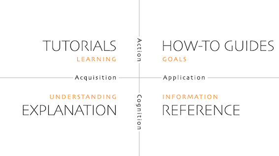

## 📝 TXTUI

Txtui is Terminal User Interface app that aims to enable user to write projects documentation in [The Diátaxis framework](https://diataxis.fr/)
- [📝 TXTUI](#-txtui)
- [1. Tutorials](#1-tutorials)
  - [Tutorial 1: Running project locally](#tutorial-1-running-project-locally)
    - [Objective](#objective)
  - [Tutorial 2: Installing pre-commit hooks](#tutorial-2-installing-pre-commit-hooks)
    - [Objective](#objective-1)
- [2. How-To Guides](#2-how-to-guides)
  - [How-To Guides](#how-to-guides)
    - [Guide 1: Installing release executable](#guide-1-installing-release-executable)
    - [Guide 2: Downloading selected release](#guide-2-downloading-selected-release)
- [3. Reference](#3-reference)
  - [About idea](#about-idea)
- [4. Explanation](#4-explanation)
  - [Project](#project)
  - [Deployment pipeline](#deployment-pipeline)
  - [Static code analysis](#static-code-analysis)

## 1. Tutorials

Tutorials:
1. **[Running project locally](#tutorial-1-local-setup)**
2. **[Installing pre-commit hooks](#tutorial-2-installing-pre-commit-hooks)**

---

### Tutorial 1: Running project locally

#### Objective
By following those steps you will setup your machine to run CLI Docs tool

Steps:
1. **Step 1**: Mac - Install rustup via [instruction](https://doc.rust-lang.org/cargo/getting-started/) from The Rust book
2. **Step 2**: Windows - Install rustup via [instruction](https://doc.rust-lang.org/cargo/getting-started/installation.html) from The Rust book
3. **Step 3**: Confirm `cargo -V` outputs version 1.82.0 or higher
4. **Step 4**: Run `cargo run` - this will build project

### Tutorial 2: Installing pre-commit hooks

#### Objective
Execute static code analysis locally

Steps:
1. **Step 1**: Install [pre-commit]()
2. **Step 2**: Run `pre-commit install` to add hook to .git/hooks/pre-commit - from now on git commit event staged files will be checked
3. **Step 3**: To run pre-commit on all files `pre-commit run --all-files`

---
## 2. How-To Guides

### How-To Guides
1. **[Guide 1: Installing release executable](#guide-1-installing-release-executable)**
2. **[Guide 2: Downloading selected release](#guide-2-downloading-selected-release)**

#### Guide 1: Installing release executable

Steps:
1. **Step for Mac**: Run `curl -fsSL https://raw.githubusercontent.com/KatKmiotek/txtui/main/install.sh | sh`
2. **Verify**: Verify installation by running `txtui -v`
3. **Execute**: Now, you can use `txtui` to run application
4. **Help**: To view all available commands run `txtui --help`
5. **Output**: Created README file gets saved in output directory ( output directory can be set via cli flag)

#### Guide 2: Downloading selected release

Steps:
1. **Step 1**: In the github repository page go to [release section](https://github.com/KatKmiotek/txtui/releases)
2. **Step 2**: Select most recent release and from within attached files package for Windows (ending .exe) or zipped package for Mac
3. **Step 3**: Mac - after download open in Finder > right-click Open with > Select your terminal + accept the source. Then you can run it in terminal `./txtui`
4. **Step 4**: Windows - run in Powershell `\txtui.exe`
---
## 3. Reference
### About idea
Cli Docs is Terminal User Interface app that aims to enable user to write projects documentation in [The Diátaxis framework](https://diataxis.fr/)

> Diátaxis solves problems related to documentation content (what to write), style (how to write it) and architecture (how to organise it).
>
>As well as **serving the users** of documentation, Diátaxis has value for **documentation creators and maintainers**. It is light-weight, easy to grasp and straightforward to apply. It doesn’t impose implementation constraints. It brings an active principle of quality to documentation that helps maintainers think effectively about their own work.

Diátaxis identifies four distinct needs, and four corresponding forms of documentation:
 - tutorials,
 - how-to guides,
 - technical reference and
 - explanation

---
## 4. Explanation

### Project
The project is TUI (terminal User Interface) written in Rust in [Ratatui](https://ratatui.rs/) framework.
The **clap** crate is used to parse CLI arguments.

### Deployment pipeline
1. **Pull Request**: on pull request event there will be number of checks performed that include pre-commit hooks and tests
2. **Merge to main**: will trigger building project into Windows and Mac binaries that are uploaded as part of tagged release
3. **Merge to main**: will also tag repository and update Cargo.toml version

### Static code analysis
Static Code Analysis runs `cargo fmt` and `clippy` commands.
Pre commit hooks can be executed locally after installation - see [guide](#tutorial-2-installing-pre-commit-hooks)

