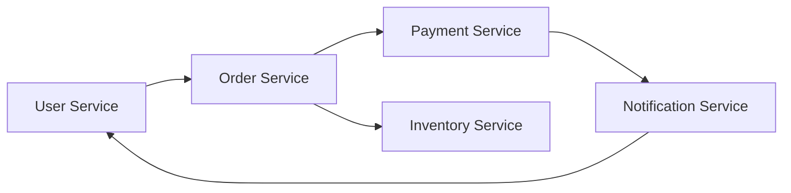

## 3. Explanations

### Purpose
> Provide conceptual information to deepen user understanding.

### Explanations
1. **[Architecture Concepts](#architecture-concepts)**
2. **[Concept Name](#explanation-2-concept-name)**

---

### Architecture Concepts

- **Overview of Project Architecture**: Brief introduction to the high-level structure of the system and design philosophy.
- **Key Decisions**:
  - **Database Selection**: Explanation of why a particular database was chosen.
  - **Microservices Architecture**: Reasoning behind the decision to use a microservices approach and associated trade-offs.
- **Diagram**: High-level diagram illustrating the overall architecture.

- **Example**: Provide examples to illustrate the concept where possible.
- **ADR**: [Link to ADR](url) or [Path to Local File](docs/adr/ADR-001.md)

### Explanation 2: Concept Name

#### Overview
> Briefly introduce the concept and its importance within the project.

#### Details
- **Key Concept 1**: Explanation of the first key concept.
- **Key Concept 2**: Explanation of the second key concept.
- **Key Concept 3**: Explanation of the third key concept.

#### Examples
> Provide examples to illustrate the concept where possible.

#### Further Reading
- Link to external resources or references.
